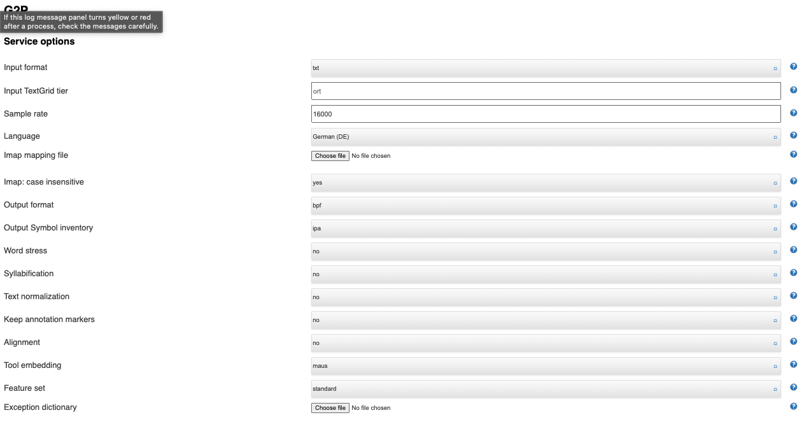

# Input Data Preparation
Use Webmaus to generate textgrid files which are annotated at the segment level

1. annotations_as_txt/
Contains a list of .txt files that contain annotations of .wav files with the same name. These were generated by creating empty .txt files with the same names as the .wav files, and using create_annotations.py to fill in the annotations based on their filename

2. Use remove_umlaut_from_filenames.sh to convert ä into ae, in preparation for WebMaus

3. Use G2P to convert these .txt files to .par files, in preparation for WebMaus General. I used the following settings:

Most noteably, Tool Embedding needs to be set to _maus_. The unzipped folder is saved as webmaus/output_g2p/

4. Upload the .par files and the accompanying .wav files (you may need to run remove_umlaut_from_filenames.sh if the .wav files still have ä characters) to WebMaus General.

5. The output TextGrid files are saved on James here: /Volumes/SSRH_LFG/LFG-Stuff/Perception_Exp/webmaus_alignment/

## To Dos:
- Manually check that the segments are annotated correctly.
- Convert SAMPA to IPA (?)
- Get a list of unique phonemes and separate them into classes, to be used in the duration script

